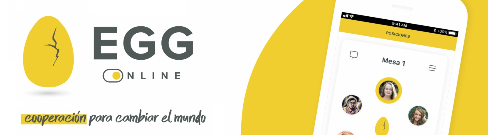

# Egg Argentina Programa 4.0

Repositorio del material y ejercicios de cada guia 
proveida por el campus de Egg Cooperation sustentado por Argentina Programa 4.0
Dirigido a la formación como 'Full Stack Developer'.

<h2>Programacion Desde Cero</h2>
<ul>
  <li>Guia 01 => Intro PSeInt</li>
  <li>Guia 02 => Estructuras Selectivas</li>
  <li>Guia 03 => Estructuras Repetitivas</li>
  <li>Guia 04 => Subprogramas</li>
  <li>Guia 05 => Arreglos</li>
  <li>Guia 06 => Matrices</li>
  <li><b>Exámen Integrador</b></li>
</ul>

<h2>Full Stack Dev</h2>
<ul>
  <li>Guia 01 => GitHub I</li>
  <li>Guia 02 => Intro a Java</li>
  <li>Guia 03 => Estructuras de control</li>
  <li>Guia 04 => Subrprogramas</li>
  <li>Guia 05 => Arreglos</li>
  <li>Guia 06 => GitHub II</li>
  <li>Guia 07 => POO</li>
  <li>Guia 08 => Clase de Servicio</li>
  <li>Guia 09 => Clase de Utilidad</li>
  <li><b>Exámen Integrador</b></li>
  <li>Guia 10 => Colecciones</li>
  <li>Guia 11 => Relaciones entre Clases</li>
  <li>Guia 12 => Herencia</li>
  <li>Guia 13 => Manejo de Excepciones</li>
  <li>Guia 14 => Base de Datos SQL</li>
  <li>Guia 15 => JDBC</li>
  <li>Guia 16 => JPA</li>
  <li><b>Exámen Integrador</b></li>
  <li>Guia 17 => HTML/CSS</li>
  <li>Guia 18 => JavaScript</li>
  <li>Guia 19 => React</li>
  <li><b>Exámen Integrador</b></li>
</ul>
